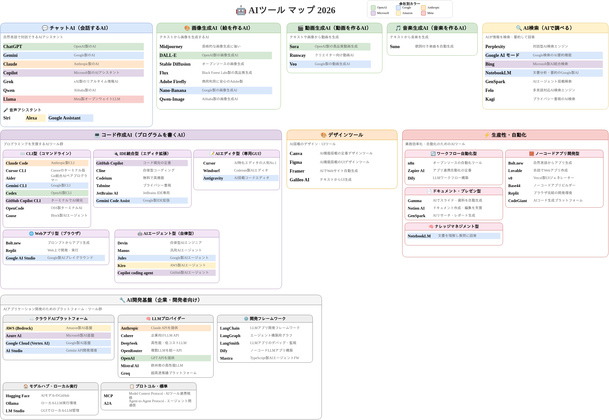

# 🤖 AIツール マップ 2026

2026年版のAIツールを俯瞰できるマップです。カテゴリ別に整理し、主要な企業のツールを色分けで視覚化しています。

## 📂 カテゴリ一覧

### 💬 チャットAI（会話するAI）
自然言語で対話できるAIアシスタント

| ツール名 | 説明 |
|---------|------|
| ChatGPT | OpenAI製のAI |
| Gemini | Google製のAI |
| Claude | Anthropic製のAI |
| Copilot | Microsoft製のAIアシスタント |
| Grok | xAI製のリアルタイム情報AI |
| Qwen | Alibaba製のAI |
| Llama | Meta製オープンウェイトLLM |

**🎤 音声アシスタント**: Siri, Alexa, Google Assistant

---

### 🎨 画像生成AI（絵を作るAI）
テキストから画像を生成するAI

| ツール名 | 説明 |
|---------|------|
| Midjourney | 芸術的な画像生成に強い |
| DALL-E | OpenAI製の画像生成AI |
| Stable Diffusion | オープンソースの画像生成 |
| Flux | Black Forest Labs製の高品質生成 |
| Adobe Firefly | 商用利用に安心のAdobe製 |
| Nano-Banana | Google製の画像生成AI |
| Qwen-Image | Alibaba製の画像生成AI |

---

### 🎬 動画生成AI（動画を作るAI）
テキストや画像から動画を生成

| ツール名 | 説明 |
|---------|------|
| Sora | OpenAI製の高品質動画生成 |
| Runway | クリエイター向け動画AI |
| Veo | Google製の動画生成AI |

---

### 🎵 音楽生成AI（音楽を作るAI）
テキストから音楽を生成

| ツール名 | 説明 |
|---------|------|
| Suno | 歌詞付き楽曲を自動生成 |

---

### 🔍 AI検索（AIで調べる）
AIが情報を検索・要約して回答

| ツール名 | 説明 |
|---------|------|
| Perplexity | 対話型AI検索エンジン |
| Google AI モード | Google検索のAI要約機能 |
| Bing | Microsoft製AI統合検索 |
| NotebookLM | 文書分析・要約のGoogle製AI |
| GenSpark | AIエージェント搭載検索 |
| Felo | 多言語対応AI検索エンジン |
| Kagi | プライバシー重視のAI検索 |

---

### 💻 コード作成AI（プログラムを書くAI）
プログラミングを支援するAIツール群

#### ⌨️ CLI型（コマンドライン）
| ツール名 | 説明 |
|---------|------|
| Claude Code | Anthropic製CLI |
| Cursor CLI | Cursorのターミナル版 |
| Aider | Git統合AIペアプログラマー |
| Gemini CLI | Google製CLI |
| Codex | OpenAI製CLI |
| GitHub Copilot CLI | ターミナルでAI補完 |
| OpenCode | OSS製ターミナルAI |
| Goose | Block製AIエージェント |

#### 🔌 IDE統合型（エディタ拡張）
| ツール名 | 説明 |
|---------|------|
| GitHub Copilot | コード補完の定番 |
| Cline | 自律型コーディング |
| Codeium | 無料で高機能 |
| Tabnine | プライバシー重視 |
| JetBrains AI | JetBrains IDE専用 |
| Gemini Code Assist | Google製IDE拡張 |

#### 📝 AIエディタ型（専用GUI）
| ツール名 | 説明 |
|---------|------|
| Cursor | AI特化エディタの人気No.1 |
| Windsurf | Codeium製AIエディタ |
| Antigravity | AI搭載コードエディタ |

#### 🤖 AIエージェント型（自律型）
| ツール名 | 説明 |
|---------|------|
| Devin | 自律型AIエンジニア |
| Manus | 汎用AIエージェント |
| Jules | Google製AIエージェント |
| Kiro | AWS製AIエージェント |
| Copilot coding agent | GitHub製AIエージェント |

#### 🌐 Webアプリ型（ブラウザ）
| ツール名 | 説明 |
|---------|------|
| Bolt.new | プロンプトからアプリ生成 |
| Replit | Web上で開発・実行 |
| Google AI Studio | Google製AIプレイグラウンド |

---

### 🎨 デザインツール
AI搭載のデザイン・UIツール

| ツール名 | 説明 |
|---------|------|
| Canva | AI機能搭載の定番デザインツール |
| Figma | AI機能搭載のUIデザインツール |
| Framer | AIでWebサイト自動生成 |
| Galileo AI | テキストからUI生成 |

---

### ⚡ 生産性・自動化
業務効率化・自動化のためのAIツール

#### 🔄 ワークフロー自動化型
| ツール名 | 説明 |
|---------|------|
| n8n | オープンソースの自動化ツール |
| Zapier AI | アプリ連携自動化の定番 |
| Dify | LLMワークフロー構築 |

#### 🧱 ノーコードアプリ開発型
| ツール名 | 説明 |
|---------|------|
| Bolt.new | 自然言語からアプリ生成 |
| Lovable | 会話でWebアプリ作成 |
| v0 | Vercel製UIジェネレーター |
| Base44 | ノーコードアプリビルダー |
| Replit | ブラウザ完結の開発環境 |
| CodeGiant | AIコード生成プラットフォーム |

#### 📄 ドキュメント・プレゼン型
| ツール名 | 説明 |
|---------|------|
| Gamma | AIでスライド・資料を自動生成 |
| Notion AI | ドキュメント作成・編集を支援 |
| GenSpark | AIリサーチ・レポート生成 |

#### 🧠 ナレッジマネジメント型
| ツール名 | 説明 |
|---------|------|
| NotebookLM | 文書を理解し質問に回答 |

---

### 🔧 AI開発基盤（企業・開発者向け）
AIアプリケーション開発のためのプラットフォーム・ツール群

#### ☁️ クラウドAIプラットフォーム
| ツール名 | 説明 |
|---------|------|
| AWS (Bedrock) | Amazon製AI基盤 |
| Azure AI | Microsoft製AI基盤 |
| Google Cloud (Vertex AI) | Google製AI基盤 |
| AI Studio | Gemini API開発環境 |

#### 🧠 LLMプロバイダー
| ツール名 | 説明 |
|---------|------|
| Anthropic | Claude APIを提供 |
| Cohere | 企業向けLLM API |
| DeepSeek | 高性能・低コストLLM |
| OpenRouter | 複数LLMを統一API |
| OpenAI | GPT APIを提供 |
| Mistral AI | 欧州発の高性能LLM |
| Groq | 超高速推論プラットフォーム |

#### ⚙️ 開発フレームワーク
| ツール名 | 説明 |
|---------|------|
| LangChain | LLMアプリ開発フレームワーク |
| LangGraph | エージェント構築用グラフ |
| LangSmith | LLMアプリのデバッグ・監視 |
| Dify | ノーコードLLMアプリ構築 |
| Mastra | TypeScript製AIエージェントFW |

#### 🏠 モデルハブ・ローカル実行
| ツール名 | 説明 |
|---------|------|
| Hugging Face | AIモデルのGitHub |
| Ollama | ローカルLLM実行環境 |
| LM Studio | GUIでローカルLLM管理 |

#### 📋 プロトコル・標準
| ツール名 | 説明 |
|---------|------|
| MCP | Model Context Protocol - AIツール連携規格 |
| A2A | Agent-to-Agent Protocol - エージェント間通信 |

---

## 🎨 会社別カラーコード

マップ内のツールは、提供元の会社によって色分けされています：

| 色 | 会社 |
|----|------|
| 🟢 緑 | OpenAI |
| 🔵 青 | Google |
| 🟠 オレンジ | Anthropic |
| 🟣 紫 | Microsoft |
| 🟡 黄 | Amazon |
| 🔴 赤 | Meta |

---

## 📝 編集方法

このマップは [Draw.io](https://app.diagrams.net/) で作成されています。

1. `ai-tools-map.drawio` ファイルを Draw.io で開く
2. 編集後、保存
3. GitHub Actions により自動的にPNG画像が生成されます

---

## License

[NYSL](http://www.kmonos.net/nysl/index.en.html)

Japanese original text: <http://www.kmonos.net/nysl/>

### What's NYSL? and Why did we chose it?

NYSL is a very loose license like a [Beer License](http://en.wikipedia.org/wiki/Beerware), or more like [WTFPL](http://en.wikipedia.org/wiki/WTFPL).
See [NYSL](http://www.kmonos.net/nysl/NYSL.TXT) for details. (English and Japanese)
